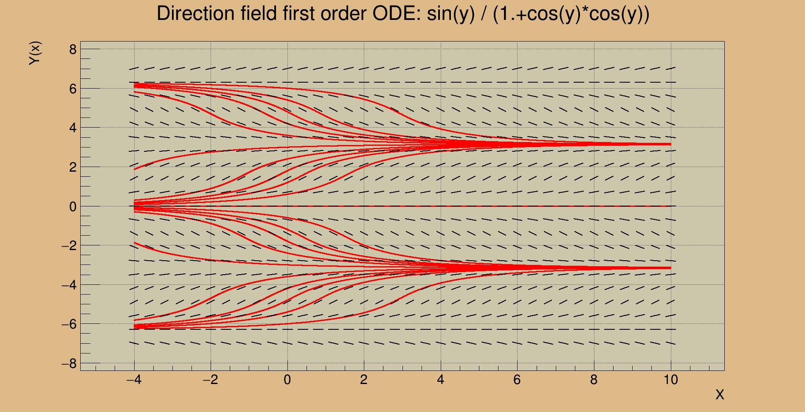
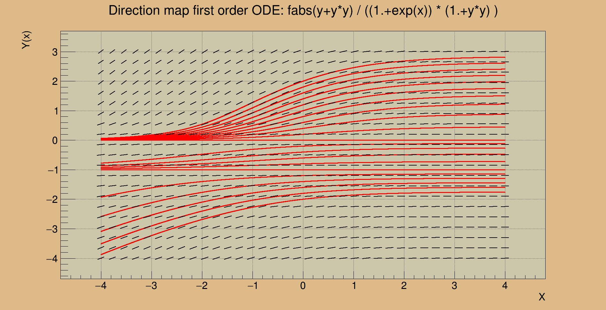

# initial-value-problem

Graphical representation of a 1-dimensional first order ordinary differential equation, expressed in the form

y'(x) = f(x,y(x))

There are two main parts:
* the first approximates the initial value problem using Runge-Kutta4 method for a list of many different initial values of the form y(0) = y_0
* the second uses ROOT\CERN to draw a representation of the direction field associated to the ODE

	`F: (x,y) -> (x+L*cos(\theta),y+L*sin(\theta))`

  with `sin(\theta)` and `cos(\theta)` derived from

	`tan(\theta) = y'(x) = f(x, y)`

  It also overlays the solutions obtained by the Runge-Kutta4 method onto the direction field.

## Usage

Set the parameters of the system in

* `./CauchyProblem/CauchyProblem.c`
* `./parameters.h`

Compile the code with `./compile.sh`
Run the code with `./run.sh`

## Examples

Examples are provided inside the `example` directory. Every example
contains both the parameters files that are used to generate it and
the output image of `direction-field`. The output of `rungekutta` are
large text files containing the points used by `direction-field`, and
are hence omitted.

## Dependencies

`direction-field` depends on the data-analysis framework ROOT\CERN.  
`rungekutta` dependencies are currently integrated in this repo.
If you wish to compile them both, please use the aforementioned
commands, otherwise it is possible to compile only `rungekutta`, details
are in the source code.

## Dependencies versions

This repo is tested on a GNU/Linux machine with

* gcc 6.3.1
* cmake 3.7.2
* root 6.06/08,  with following features activated: `root-config --features`: 
> asimage astiff bonjour builtin_llvm cxx14 cling exceptions
> explicitlink fftw3 fitsio fortran gviz genvector gnuinstall
> gsl_shared krb5 ldap mathmore memstat minuit2 mt mysql odbc opengl
> pch pgsql python roofit shadowpw shared sqlite ssl tbb thread tmva
> vdt xft xml x11

## Status

This programs have been written to have a better understanding of the
initial value problems while studying for the Advanced Calculus
course. The correct output has been considered as the only measure
to assert the quality of the code, which in result is far from
being clean and optimized and may contain some not-so-nice workarounds.
For example, I am sorry for the messy way of setting the parameters.
I may consider to upgrade it in a remote future.

## Example images

Example 1

Example 5

